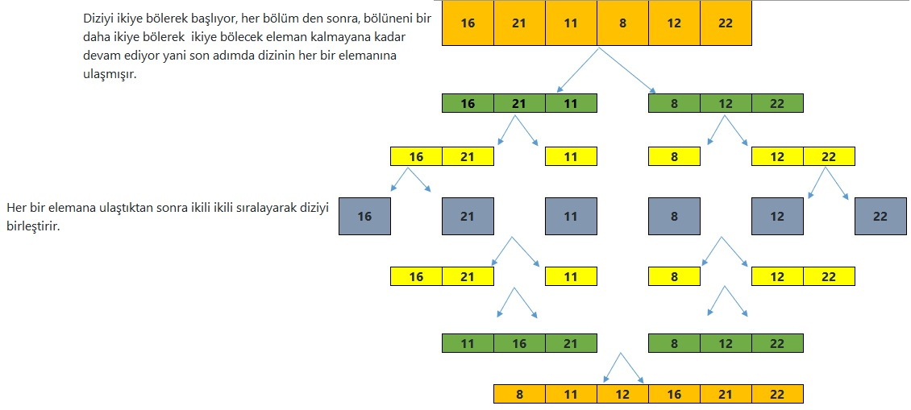

# Merge Sort
# Proje 2

Diziyi ikiye bölerek başlıyor, her bölüm den sonra, bölüneni bir daha ikiye bölerek  ikiye bölecek eleman 
kalmayana kadar devam ediyor yani son adımda dizinin her bir elemanına ulaşmışır.

# Big-O gösterimini yazınız.
Recursive bir fonksiyon olduğundan  sürekli kendini çağırarak diziyi hep ikiye bölmektedir. 
Her bölünmüş dizinin Merge işlemi için de dizinin uzunluğu olan 'n' işlem yapıldığından 'O(n*(logn)) => O(6*(log6))' olacaktır.
